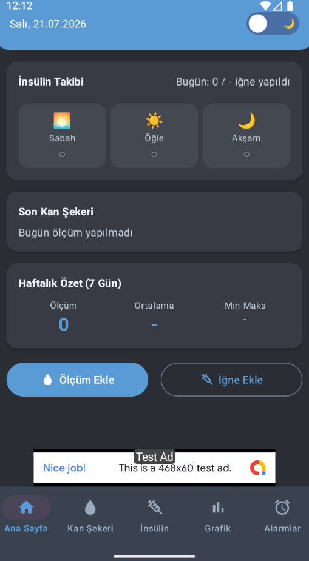
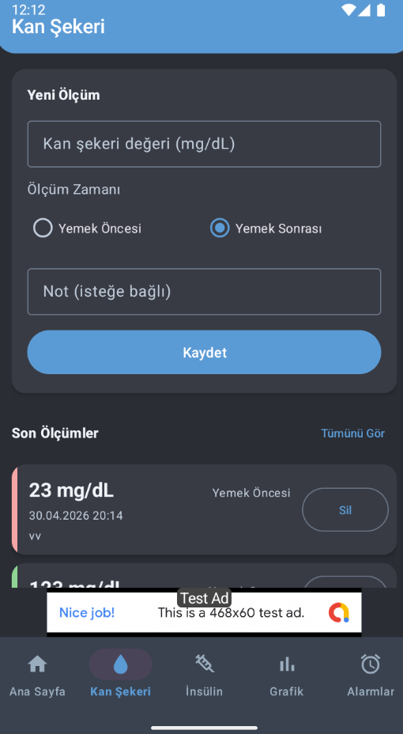
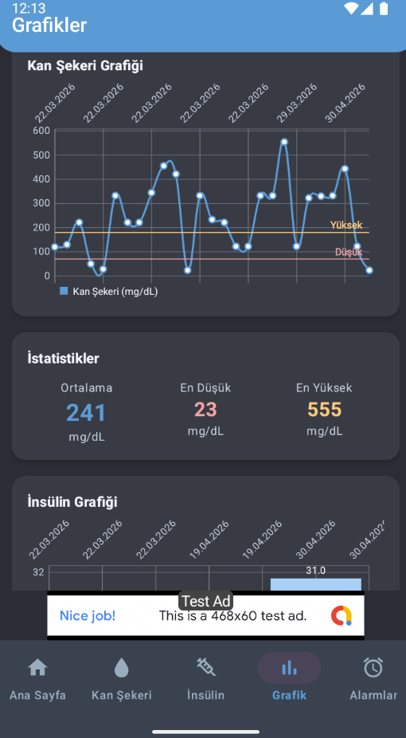
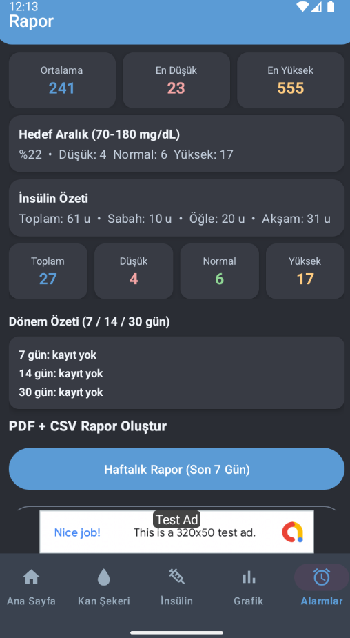

# 💉 Diyabet Takip Asistanı

[](https://kotlinlang.org)
[](https://developer.android.com)
[]()
[](https://m3.material.io)

Diyabet hastalarının insülin enjeksiyon saatlerini kaçırmaması, kan şekeri (glikoz) değerlerini düzenli kayıt altına alması ve doktor kontrolleri için PDF raporları oluşturabilmesi amacıyla geliştirilmiş modern bir Android uygulamasıdır.

---

## 📸 Ekran Görüntüleri

| Ana Sayfa (Gündüz) | Ana Sayfa (Gece) | Glikoz Kaydı | Raporlama |
| :---: | :---: | :---: | :---: |
|  |  |  |  |

>

---

## ✨ Öne Çıkan Özellikler

* ⏰ **Akıllı İnsülin Hatırlatıcı:** `WorkManager` altyapısı ile zamanlanmış enjeksiyon bildirimleri.
* 🩸 **Glikoz Seviyesi Takibi:** Ölçülen kan şekeri değerlerini geçmişe dönük kaydetme ve görselleştirme.
* 🌙 **Dinamik Gece / Gündüz Modu:** Material 3 standartlarında tam uyumlu tema desteği.
* 📄 **PDF Rapor Çıktısı:** Kaydedilen verileri doktor kontrolüne uygun PDF formatında dışa aktarma.
* 🔒 **Yerel Depolama (Offline-First):** Tüm veriler `Room Database` ile cihazda güvenli şekilde saklanır.

---

## 🛠️ Teknoloji Yığını ve Mimari

* **Dil:** Kotlin
* **Mimari:** MVVM (Model-View-ViewModel) + Repository Pattern
* **Arayüz:** XML Layouts, Material Design 3, View Binding
* **Jetpack Bileşenleri:**
  * **Room:** Yerel veri tabanı yönetimi
  * **WorkManager:** Arka plan zamanlanmış hatırlatıcı bildirimleri
  * **Navigation Component:** Ekranlar arası güvenli geçiş yönetimi
  * **LiveData & ViewModel:** Reaktif durum yönetimi

---

## 📂 Yayın Hazırlık Dokümanları

Projenin mağaza yayını ve yasal süreçleriyle ilgili kaynak dosyalar:

* 📜 [Gizlilik Politikası (TR)](docs/privacy-policy-tr.md)
* 🏪 [Play Store Metinleri (TR)](docs/play-store-listing-tr.md)
* 📐 [Görsel Ölçüleri ve Varlık Listesi](docs/asset-specs.md)
* ✅ [Yayın Öncesi Kontrol Listesi](docs/release-checklist.md)

---

## ⚙️ Derleme ve Reklam Yapılandırması

* **Debug Derlemesi:** Test reklam ID'leri kullanılır.
* **Release Derlemesi:** Gerçek reklam ID'leri kullanılır.

---

## 🚀 Projeyi Çalıştırma

1. Repoyu klonlayın:
   ```bash
   git clone [https://github.com/ismailbrngl/Diyabet-Takip-Asistani.git](https://github.com/ismailbrngl/Diyabet-Takip-Asistani.git)